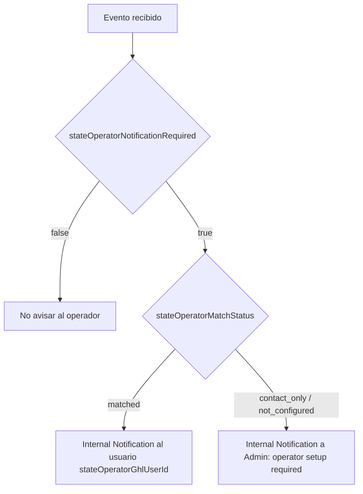

# Arquitectura GHL optimizada por costo

Este es el contrato operativo de My Drip Nurse con GoHighLevel. La decisión de a quién comunicar no se infiere en GHL: el sistema la envía explícitamente en cada payload.

## Regla económica y limitación real de GHL

- Usamos sólo **tres URLs inbound** y tres workflows router.
- Cada evento canónico genera un solo `POST` a su router.
- Un workflow inbound tiene un solo contacto externo activo. Desde esa ejecución sí puede enviar SMS/email a ese contacto y notificaciones internas a varios usuarios de GHL.
- Si un mismo hecho requiere comunicar a dos contactos externos distintos —por ejemplo Partner y cliente— el sistema emite dos eventos de contacto al mismo router. Esto cuesta dos requests, pero evita enviar información al contacto equivocado.
- Admin y State Operator deben ser usuarios internos de GHL. Sus alertas se incluyen en la ejecución del contacto principal sin crear otro webhook.

No se debe intentar usar `Send SMS` dos veces con teléfonos arbitrarios en una misma matrícula. Para destinatarios externos, GHL opera sobre el contacto actual del workflow.

## Los tres workflows

| Código | Nombre exacto en GHL | `workflowRouter` | Responsabilidad |
|---|---|---|---|
| R01 | `MDN \| Router 01 \| Partner Applications` | `partner_applications` | Solicitud, revisión y activación de Partners |
| R02 | `MDN \| Router 02 \| Booking & Appointments` | `booking_appointments` | Leads, citas, pagos, lifecycle y operaciones |
| R03 | `MDN \| Router 03 \| Care Rewards` | `care_rewards` | Invitaciones, progreso y Rewards de Care |

## Contrato de enrutamiento común

Todos los eventos entregados a GHL incluyen estas propiedades planas:

| Propiedad | Uso en GHL |
|---|---|
| `routingVersion` | Versión del contrato. Actualmente `1`. |
| `communicationEvent` | Evento exacto que decide la rama. |
| `workflowRouter` | Debe coincidir con el router donde llegó el request. |
| `primaryAudience` | Audiencia externa actual o `admin` para ejecución interna. |
| `primaryRecipientRole` | Rol normalizado del contacto actual. |
| `primaryRecipientId` | ID interno, cuando existe. |
| `primaryRecipientFirstName` | Nombre normalizado. |
| `primaryRecipientLastName` | Apellido normalizado. |
| `primaryRecipientFullName` | Nombre completo normalizado. |
| `primaryRecipientEmail` | Email para buscar/crear el contacto. |
| `primaryRecipientPhone` | Teléfono E.164 para buscar/crear el contacto. |
| `primaryRecipientReady` | `true` si existe email o teléfono. |
| `externalRecipientCount` | Cantidad de audiencias externas representadas por el payload. |
| `externalDeliveryMode` | `single_contact`, `multi_contact` o `internal_only`. |
| `requiresSecondaryContactWorkflow` | `true` cuando otro contacto externo necesita su propio evento. |
| `secondaryRecipient*` | Datos de auditoría del segundo contacto; no se usan como contacto actual. |
| `notifyApplicant` | Rama de comunicación al solicitante. |
| `notifyPartner` | Rama de comunicación al Partner actual. |
| `notifyCustomer` | Rama de comunicación al cliente. |
| `notifyInvitee` | Rama de comunicación al invitado. |
| `notifyInviter` | Rama de comunicación al cliente que invitó. |
| `notifyAdmin` | Ejecutar Internal Notification a Admin. |
| `notifyStateOperator` | Ejecutar Internal Notification al operador configurado. |

### Regla de contacto en GHL

1. Si `primaryRecipientReady = true`, buscar/crear el contacto usando `primaryRecipientEmail` y luego `primaryRecipientPhone`.
2. Enviar SMS/email sólo si el `notify...` correspondiente a `primaryRecipientRole` es `true`.
3. Si `primaryAudience = admin`, ejecutar el workflow sin crear un contacto externo y usar Internal Notification.
4. Nunca cambiar el contacto actual usando `secondaryRecipientPhone` o `secondaryRecipientEmail`.
5. Si `requiresSecondaryContactWorkflow = true`, ese segundo destinatario necesita un evento separado antes de activar su comunicación.

## Decisión del State Operator

El operador se resuelve por mercado, usando `stateOperatorResolutionKey` con formato `país|estado`, por ejemplo `us|florida`.

### Propiedades del operador

| Propiedad | Significado |
|---|---|
| `marketCountryCode` | País del servicio; normalmente `US`. |
| `marketState` | Estado que controla el operador. |
| `marketCounty` | County del evento. |
| `marketCity` | Ciudad del evento. |
| `marketCoverageStatus` | `available`, `unavailable` o `unknown`. |
| `marketAvailabilityStatus` | `available`, `unavailable` o `unknown`. |
| `eligiblePartnerCount` | Partners elegibles detectados para ese intento. |
| `stateOperatorResolutionKey` | Llave normalizada para resolver el operador. |
| `stateOperatorNotificationRequired` | El tipo de evento requiere intervención/visibilidad del operador. |
| `stateOperatorNotificationReason` | Razón exacta del aviso. |
| `stateOperatorContactAvailable` | Hay datos del operador, aunque todavía no sea usuario de GHL. |
| `stateOperatorGhlUserConfigured` | Existe `stateOperatorGhlUserId`. |
| `stateOperatorMatchStatus` | `matched`, `contact_only`, `not_configured` o `not_required`. |
| `stateOperatorDeliveryRoute` | `ghl_internal_user`, `admin_fallback` o `none`. |
| `stateOperatorId` | ID interno del operador. |
| `stateOperatorGhlUserId` | ID del usuario interno de GHL que recibe la alerta. |
| `stateOperatorFullName` | Nombre para auditoría/mensaje. |
| `stateOperatorEmail` | Email operativo. |
| `stateOperatorPhone` | Teléfono operativo. |

### Árbol de decisión

El operador recibe alertas cuando `stateOperatorNotificationReason` sea uno de estos valores:

- `new_partner_approved_in_state`
- `booking_lead_without_coverage`
- `booking_lead_without_availability`
- `booking_lead_without_eligible_partner`
- `appointment_declined`
- `appointment_rescheduled_by_partner`
- `appointment_refunded`
- `unmapped_event_review`

La primera versión usa al operador como usuario interno de GHL. Esto permite avisarle en la misma matrícula y evita otro request de webhook. Si más adelante el operador debe ser un contacto externo, se creará un evento de contacto separado.

## R01 — Partner Applications

Nombre exacto: `MDN | Router 01 | Partner Applications`

La misma URL se guarda en:

- **Application received**
- **Account-ready welcome**

Deja **Administrator alert** vacío. `partner_application_received` ya lleva `notifyAdmin = true`, por lo que Admin recibe una notificación interna desde la misma matrícula.

| `communicationEvent` | Contacto actual | Comunicación externa | Interna |
|---|---|---|---|
| `partner_application_received` | Applicant | SMS + email de recepción | Admin |
| `partner_account_ready` | Partner aprobado | SMS + email de activación | State Operator si está configurado; si no, Admin fallback |

## R02 — Booking & Appointments

Nombre exacto: `MDN | Router 02 | Booking & Appointments`

La misma URL se guarda en los destinos específicos de booking y lifecycle. Los destinos heredados/agregados sólo se dejan activos cuando sean el canal que emite los eventos de cliente indicados abajo.

| `communicationEvent` | Contacto actual | Acciones |
|---|---|---|
| `booking.lead.created` | Customer/lead | Upsert CRM y oportunidad; Admin interno; operador si no hay Partner elegible |
| `new_booking` | Partner | Oferta SMS/email |
| `customer.appointment.confirmed` | Customer | Confirmación SMS/email |
| `customer.appointment.patient_invited` | Paciente adicional | Upsert de contacto + invitación SMS/email |
| `partner_confirmation_required` | Ninguno | Monitoreo interno; no repetir oferta |
| `appointment_accepted` | Customer | Profesional asignado por SMS/email |
| `appointment_declined` | Ninguno | Admin y operador internos; no alertar al cliente todavía |
| `appointment_reassigned` | Nuevo Partner | Nueva oferta SMS/email |
| `partner_rescheduled` | Ninguno | Admin y operador internos |
| `customer.appointment.rescheduled` | Customer | Nueva fecha SMS/email |
| `appointment_completed` | Customer | Cierre SMS/email y continuidad de Rewards |
| `appointment_refunded` | Ninguno | Admin/Finanzas y operador internos |
| `customer.appointment.deposit_refunded` | Customer | Confirmación de refund SMS/email |

### Por qué una cita nueva usa dos requests

`new_booking` crea la matrícula del Partner. `customer.appointment.confirmed` crea la matrícula del cliente. Ambos usan la misma URL R02, pero representan dos contactos externos distintos y por eso no se deben fusionar.

Cada paciente adicional se envía como una matrícula compacta `customer.appointment.patient_invited` al mismo R02. Esto permite que GHL trabaje con un contacto actual inequívoco, haga el upsert y entregue SMS/email sin depender de Resend. Todos los eventos comparten `notificationGroupId = appointmentId`, pero conservan un `idempotencyKey` por destinatario.

### Visita financiada por My Drip Nurse

En `appointment_accepted`, el contacto actual es el cliente. Si además `platformFunded = true`, el payload marca `notifyPartner = true`, `secondaryAudience = partner` y `requiresSecondaryContactWorkflow = true`. No actives el SMS/email financiado al Partner dentro de esa matrícula. El flujo queda listo para un evento dedicado `partner.appointment.platform_funded`, que debe ser implementado/probado antes de producción.

## R03 — Care Rewards

Nombre exacto: `MDN | Router 03 | Care Rewards`

La URL se guarda en **Client referral invitations**.

| `communicationEvent` | Contacto actual | Acción |
|---|---|---|
| `client.referral.invite.created` | Invitee | SMS preparado por el sistema; email si existe |
| `client.referral.registered` | Inviter | SMS/email de progreso |
| `client.referral.reward.earned` | Inviter | SMS/email del reward |

## Estructura obligatoria dentro de cada router

1. Trigger **Inbound Webhook**.
2. Gate: si `body.test = true`, mapear y terminar sin comunicación real.
3. Gate: confirmar que `body.workflowRouter` coincide con el router.
4. Gate de idempotencia por `body.idempotencyKey` o `body.eventId`.
5. Switch por `body.communicationEvent`.
6. Preparar el contacto actual con `body.primaryRecipient*`, cuando aplique.
7. Ejecutar SMS/email de la rama.
8. Si `body.notifyAdmin = true`, enviar Internal Notification a Admin.
9. Si `body.stateOperatorDeliveryRoute = ghl_internal_user`, enviar Internal Notification al usuario indicado.
10. Si `body.stateOperatorDeliveryRoute = admin_fallback`, avisar a Admin que falta configurar el operador.
11. Guardar evento, referencia, mercado y fecha para auditoría.

## Optimización lograda

- Solicitud: un request R01 comunica al Applicant y notifica internamente a Admin.
- Aprobación: un request R01 comunica al Partner y puede notificar internamente al operador.
- Eventos exclusivamente internos: un request R02 puede avisar a Admin y operador.
- Partner y cliente externos: dos eventos/contactos separados en R02. Es el mínimo seguro en GHL.
- Pacientes adicionales: una matrícula R02 por contacto; no se envían arrays gigantes ni se crean workflows inbound adicionales.
- Rewards: un solo router R03, una matrícula por evento real.

Los SMS/emails y sus variables están enlazados desde el [plan maestro de pruebas](./end-to-end-system-test-plan.md).
